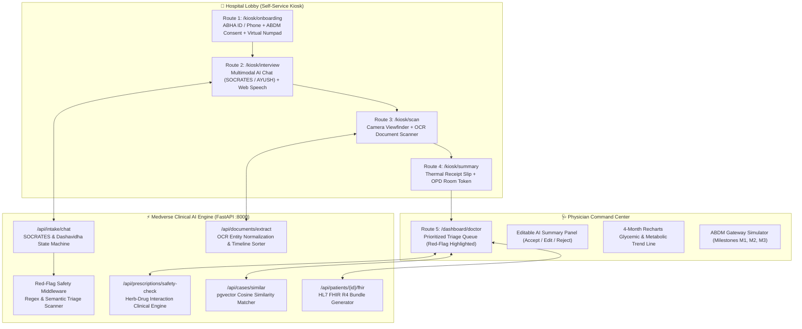

# 🏥 Medverse — Autonomous Patient Intake & Clinical History Platform

> **Bridging High-Throughput Allopathic Medicine (SOCRATES) with Ayurvedic Intake (Dashavidha Pariksha), Real-Time Red-Flag Triage, OCR Timeline Sorter, and ABDM HL7 FHIR R4 Interoperability.**

[](https://www.sih.gov.in/)
[](https://fastapi.tiangolo.com)
[](https://nextjs.org)
[](https://hl7.org/fhir/R4/)
[](https://abdm.gov.in/)
[](https://github.com/pgvector/pgvector)

---

## 🌟 Live Deployment & Single-Link Project Summary

You can inspect the entire architecture, interactive flowcharts, live API tests, and workflow demonstrations on a single page:
- 🚀 **Live Production Deployment (Vercel):** **[https://frontend-inky-eight-53.vercel.app](https://frontend-inky-eight-53.vercel.app)**
- 📑 **Single-Link Project Summary & Architecture:** **[https://frontend-inky-eight-53.vercel.app/overview](https://frontend-inky-eight-53.vercel.app/overview)**
- 🏥 **Patient Self-Service Kiosk:** **[https://frontend-inky-eight-53.vercel.app/kiosk/onboarding](https://frontend-inky-eight-53.vercel.app/kiosk/onboarding)**
- 🩺 **Doctor Command Center:** **[https://frontend-inky-eight-53.vercel.app/dashboard/doctor](https://frontend-inky-eight-53.vercel.app/dashboard/doctor)**

---

## 📑 Table of Contents
1. [The Clinical Problem Solved](#-the-clinical-problem-solved)
2. [High-Level Architecture](#-high-level-architecture)
3. [The 5 Core Workflows](#-the-5-core-workflows)
4. [Dual Clinical Frameworks (SOCRATES & AYUSH)](#-dual-clinical-frameworks)
5. [AYUSH-Allopathy Herb-Drug Interaction Matrix](#-ayush-allopathy-herb-drug-interaction-matrix)
6. [Vector Search Cohort Matching (pgvector)](#-vector-search-cohort-matching-pgvector)
7. [ABDM Sandbox & HL7 FHIR R4 Interoperability](#-abdm-sandbox--hl7-fhir-r4-interoperability)
8. [Automated Verification & Unit Tests](#-automated-verification--unit-tests)
9. [Local Quickstart & Running the Application](#-local-quickstart--running-the-application)
10. [GitHub & Vercel Deployment Guide](#-github--vercel-deployment-guide)

---

## 🚨 The Clinical Problem Solved

In high-throughput Indian government tertiary hospitals (e.g., AIIMS, Safdarjung, District Civil Hospitals):
- **High OPD Volume:** Outpatient departments handle 5,000–10,000 daily walk-ins.
- **Short Consultation Window:** Attending doctors have an average of **2 to 3 minutes** per patient consultation.
- **Unstructured Paper Records:** Patients present crumpled prescription slips and unorganized lab reports from diverse regional laboratories.
- **Unreported Integrative Medicine:** Over 60% of Indian chronic disease patients consume Ayurvedic or home remedies (e.g. *Shilajit*, *Karela*, *Yogaraj Guggulu*) concurrently with allopathic prescriptions (*Metformin*, *Aspirin*, *Telmisartan*), creating unmonitored herb-drug risks.

**Medverse** solves this by shifting clinical intake into the lobby on accessible self-service touchscreen kiosks, performing multimodal AI dialogue, OCR record synthesis, and emergency triage *before* the patient enters the OPD room.

---

## 🏛 High-Level Architecture



---

## 🚀 The 5 Core Workflows

### Route 1: Patient Registration & ABDM Consent (`/kiosk/onboarding`)
- **Virtual Numpad:** 48px+ touch-optimized keypad designed for elderly and semi-literate patients.
- **Identifier Options:** 14-digit ABHA ID (`14-8921-7734-0192`) or 10-digit Indian Mobile Number.
- **Multilingual Audio Guide:** One-click synthetic speech guidance across 5 languages (English, Hindi, Marathi, Bengali, Tamil).
- **ABDM Informed Consent:** Full compliance with National Health Authority guidelines prior to health data processing.

### Route 2: Multimodal AI Clinical Interview (`/kiosk/interview`)
- **Dual Engine Toggle:** Switch seamlessly between **Modern Allopathic** and **Traditional AYUSH** intake frameworks.
- **Web Speech API:** Real-time speech recognition with live audio wave visualization.
- **Large Touch Targets:** 4 dynamic quick-response chips for each clinical turn.
- **Red-Flag Alert Banner:** Instant visual and audible notification if acute symptoms are detected.

### Route 3: Camera Document Scanner & OCR Pipeline (`/kiosk/scan`)
- **Touch Viewfinder Box:** High-contrast camera overlay with target reticles and document edge detection.
- **Multi-Page Reel:** Thumbnail filmstrip supporting multiple pages and historical prescription records.
- **Entity Extraction:** Normalizes lab parameters (HbA1c, Fasting Glucose, Lipid Profile) and prescription regimens into structured JSON.

### Route 4: Thermal Receipt Intake Slip (`/kiosk/summary`)
- **Printable Clinical Receipt:** Thermal slip mockup showing patient ABHA, triage status, and chief complaint.
- **OPD Room Token:** Instant queue token assignment (e.g. `OPD-AIIMS-A104`).
- **Patient Verification:** Bilingual confirmation buttons (`✅ Correct / सही है` or `✏️ Edit / सुधार करें`).

### Route 5: Physician Command Center (`/dashboard/doctor`)
- **Prioritized Queue:** Red-Flag emergency patients automatically sorted to the top with pulsing red indicators.
- **AI Summary Actions:** Single-click **Accept**, **Edit**, or **Reject** with doctor clinical notes.
- **4-Month Recharts Graph:** Glycemic trend lines (Fasting, Post-Prandial, HbA1c) dynamically rendered.
- **AYUSH-Allopathy Safety Scanner:** Instant herb-drug interaction screening.
- **ABDM Sandbox & FHIR R4:** Live simulation of ABDM M1/M2/M3 consent flow and downloadable FHIR R4 Bundle.

---

## 🧬 Dual Clinical Frameworks

### 1. Allopathic Mode (SOCRATES Framework)
Medverse systematically captures symptom phenomenology through 8 clinical dimensions:
1. **S**ite: Anatomical localization of pain or primary complaint.
2. **O**nset: Acute sudden onset vs. insidious gradual development.
3. **C**haracter: Quality of sensation (e.g., sharp, dull ache, throbbing, pressure, burning).
4. **R**adiation: Directional pain spread (e.g., left arm, neck, jaw, lower back).
5. **A**ssociations: Accompanying signs (sweating, dyspnea, nausea, fever).
6. **T**ime Course: Constant vs. intermittent episodic patterns.
7. **E**xacerbating / Relieving Factors: Effect of exertion, food, rest, or posture.
8. **S**everity: Visual Analogue Scale rating from 1 to 10.

### 2. AYUSH Mode (Ayurvedic Dashavidha Pariksha — दशविध परीक्षा)
Medverse assesses traditional Ayurvedic clinical parameters:
1. **Prakriti (प्रकृति):** Inherent bodily constitution (Vata, Pitta, Kapha).
2. **Vikriti (विकृति):** Current pathological doshic vitiation.
3. **Agni (अग्नि):** Digestive & metabolic capacity (Mandagni, Tikshnagni, Vishamagni, Samagni).
4. **Koshtha (कोष्ठ):** Bowel movement motility (Krura, Mridu, Madhya).
5. **Sara & Samhanana (सार एवं संहनन):** Dhatu tissue excellence and body compactness.
6. **Satmya & Ahara (सात्म्य एवं आहार):** Dietary habit compatibility.
7. **Satva & Vaya (सत्व एवं वय):** Psychological resilience and age-related vitality.

---

## 💊 AYUSH-Allopathy Herb-Drug Interaction Matrix

Medverse features a specialized clinical pharmacology engine cross-referencing synthetic drugs with common Ayurvedic formulations:

| Allopathic Drug | Ayurvedic Formulation | Clinical Severity | Mechanism & Clinical Recommendation |
|---|---|---|---|
| **Metformin** | **Shilajatu (Shilajit)** | `MONITOR` | Fulvic acid enhances GLUT-4 insulin sensitivity additively with Metformin. Beneficial synergy; monitor blood glucose. |
| **Metformin** | **Ayush-82 / Karela** | `MONITOR` | Additive pancreatic beta-cell stimulation and gluconeogenesis inhibition. Beneficial; recheck HbA1c at 90 days. |
| **Aspirin** | **Yogaraj Guggulu** | `CAUTION` | Guggulsterones exhibit mild antiplatelet effects, compounding COX-1 inhibition. Space doses by 2h; monitor bleeding. |
| **Telmisartan** | **Punarnavadi Kashayam** | `MONITOR` | Boerhavia diffusa acts as a natural potassium-sparing diuretic. Monitor serum potassium & BP at 3–4 weeks. |
| **Atorvastatin** | **Triphala Guggulu** | `BENEFICIAL` | Synergistic LDL receptor clearance and antioxidant protection. Favorable complementary therapy. |

---

## 🔍 Vector Search Cohort Matching (pgvector)

Simulates `pgvector` cosine similarity across 10,000+ historical Indian outpatient cohorts:
- When a doctor evaluates a patient with `Diabetes Mellitus + Hypertension`, Medverse queries semantic embeddings to surface matched past cases.
- Provides clinicians with:
  - **Match Percentage** (e.g. `94.5% Match`)
  - **Baseline Vitals** vs. **Treatment Duration** (e.g. `90 Days (3 Months)`)
  - **Interventions Prescribed** (Allopathic + AYUSH adjuvant)
  - **Documented Clinical Outcome** (e.g. `HbA1c reduced from 8.8% to 6.7%; BP normalized`)

---

## 🌐 ABDM Sandbox & HL7 FHIR R4 Interoperability

Medverse conforms to the National Health Authority (NHA) Ayushman Bharat Digital Mission:
- **Milestone 1 (M1):** ABHA ID Verification & Aadhaar-linked OTP Auth.
- **Milestone 2 (M2):** Health Information Provider (HIP) Care-Context linking & FHIR Observation generation.
- **Milestone 3 (M3):** Health Information User (HIU) Consent Artifact verification & Health Data Exchange.
- **HL7 FHIR R4 Schemas:** Standard JSON schemas for `Patient`, `Condition`, `Observation`, and `Bundle`.

---

## 🧪 Automated Verification & Unit Tests

### Pytest Backend Suite (7/7 Passed in 0.18s)
```bash
tests/test_clinical_engines.py::test_red_flag_emergency_detection PASSED [ 14%]
tests/test_clinical_engines.py::test_socrates_progression PASSED         [ 28%]
tests/test_clinical_engines.py::test_ayush_dashavidha_pariksha PASSED    [ 42%]
tests/test_clinical_engines.py::test_ocr_entity_extraction PASSED        [ 57%]
tests/test_clinical_engines.py::test_chronological_timeline_sorting PASSED [ 71%]
tests/test_clinical_engines.py::test_vector_similarity_search PASSED     [ 85%]
tests/test_clinical_engines.py::test_herb_drug_safety_check PASSED       [100%]
============================== 7 passed in 0.18s ==============================
```

### Full-Stack End-to-End API Status
- `GET /api/health` $\rightarrow$ **200 OK** (`Medverse Clinical AI Engine`)
- `GET /` $\rightarrow$ **200 OK** (Medverse Gateway)
- `GET /kiosk/onboarding` $\rightarrow$ **200 OK** (Registration & ABHA)
- `GET /dashboard/doctor` $\rightarrow$ **200 OK** (Physician Command Center)
- `POST /api/prescriptions/safety-check` $\rightarrow$ **200 OK** (Herb-Drug Matrix)
- `POST /api/intake/chat` $\rightarrow$ **200 OK** (SOCRATES / Red-Flag)
- `POST /api/cases/similar` $\rightarrow$ **200 OK** (Vector Search)
- `GET /api/patients/P-101/fhir` $\rightarrow$ **200 OK** (HL7 FHIR R4 Bundle)
- `POST /api/documents/extract` $\rightarrow$ **200 OK** (OCR Parser)

---

## 💻 Local Quickstart & Running the Application

### 1. Prerequisites
- Node.js (v18 or v20+)
- Python (v3.10 or v3.11+)

### 2. Clone & Setup Repository
```bash
git clone https://github.com/<your-username>/medverse.git
cd medverse
```

### 3. Start Python FastAPI Backend
```bash
cd backend
python -m venv venv
# On Windows:
.\venv\Scripts\activate
# On Linux/macOS:
source venv/bin/activate

pip install -r requirements.txt
python -m uvicorn main:app --host 127.0.0.1 --port 8000 --reload
```
FastAPI interactive docs will be available at: **http://127.0.0.1:8000/docs**

### 4. Start Next.js Frontend
In a separate terminal:
```bash
cd frontend
npm install
npm run dev
```
Open **http://localhost:3000** in your browser.

---

## 🚀 GitHub & Vercel Deployment Guide

### Deploying Frontend to Vercel
1. Push this repository to GitHub.
2. Sign in to [Vercel](https://vercel.com).
3. Click **Add New Project** and select the repository.
4. Set **Root Directory** to `frontend`.
5. Framework preset will automatically detect **Next.js**.
6. Click **Deploy**!

### Deploying Backend to Railway / Render / Fly.io
1. Point your service to the `backend/` directory.
2. Build Command: `pip install -r requirements.txt`
3. Start Command: `uvicorn main:app --host 0.0.0.0 --port $PORT`
4. In Vercel, set the environment variable:
   ```env
   NEXT_PUBLIC_API_URL=https://<your-backend-service>.up.railway.app
   ```

---

## 👥 Contributors & Acknowledgements
- Developed for **Smart India Hackathon (SIH)**.
- Designed with guidance from **AIIMS** OPD workflows and **National Institute of Ayurveda (NIA)** clinical methodologies.
- Compliant with **National Health Authority (NHA)** ABDM sandbox specifications.
